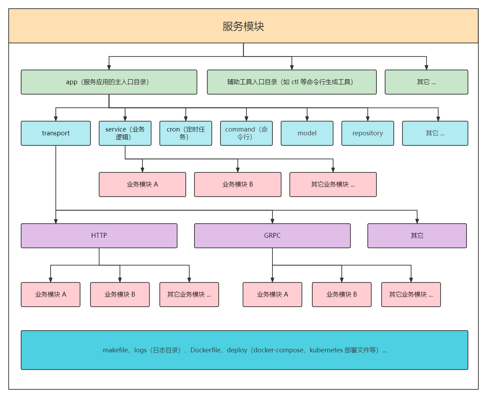
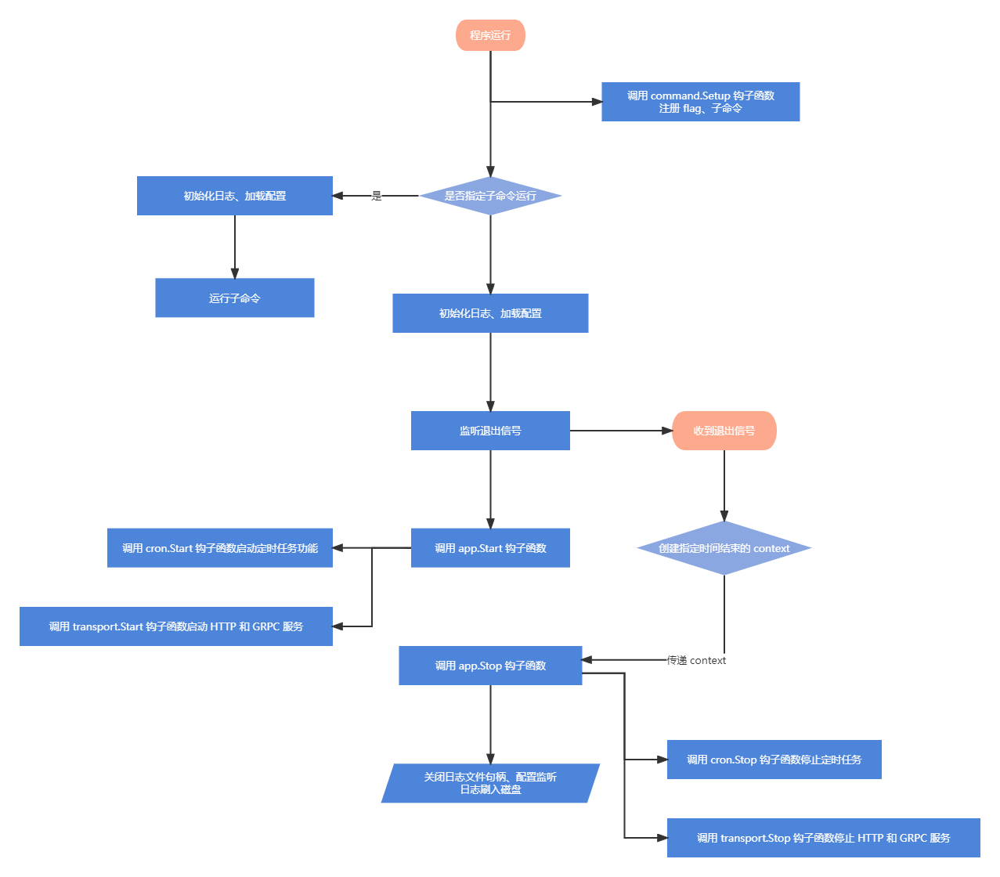
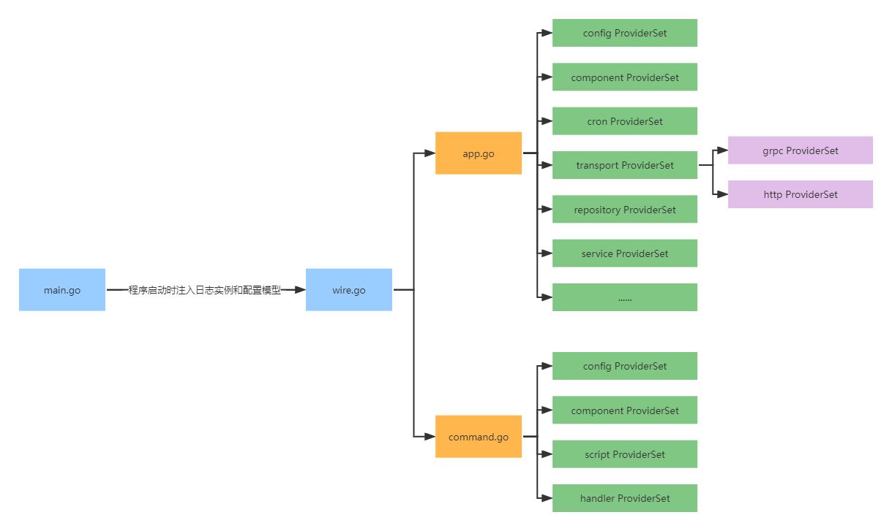

* [介绍](#介绍)
* [架构图](#架构图)
* [生命周期](#生命周期)
* [目录结构](#目录结构)
* [如何运行](#如何运行)
  * [go build 或 go run](#go-build-或-go-run)
  * [make](#make)
  * [docker-compose](#docker-compose)
  * [热重启](#热重启)
  * [运行子命令或脚本](#运行子命令或脚本)
* [依赖注入](#依赖注入)
* [配置](#配置)
  * [配置模型](#配置模型)
  * [远程配置](#远程配置)
  * [监听配置变更](#监听配置变更)
* [日志](#日志)
* [错误处理](#错误处理)
  * [转换为 HTTP 状态码](#转换为-http-状态码)
  * [将 GRPC 错误转换为 Error](#将-grpc-错误转换为-error)
* [组件](#组件)
  * [Casbin](#casbin)
  * [Client](#client)
    * [gRPC 客户端](#grpc-客户端)
  * [Discovery 服务发现与注册](#discovery-服务发现与注册)
  * [Ent](#ent)
  * [orm](#orm)
  * [Redis 客户端](#redis-客户端)
  * [trace](#trace)
  * [uid](#uid)
* [transport 层](#transport-层)
  * [HTTP](#http)
    * [响应](#响应)
    * [swagger 文档生成](#swagger-文档生成)
    * [如何访问 swagger 文档](#如何访问-swagger-文档)
* [service 层](#service-层)
* [命令行功能模块](#命令行功能模块)
* [cron 定时任务功能模块](#cron-定时任务功能模块)
* [如何部署](#如何部署)
  * [Dockerfile](#dockerfile)
  * [docker-compose](#docker-compose-1)
  * [kubernetes](#kubernetes)

# 介绍

`go-scaffold` 是一个基于 [cobra](https://github.com/spf13/cobra) 和 [kratos](https://github.com/go-kratos/kratos) 框架的脚手架，设计思想是基于 [wire](https://github.com/google/wire) 实现模块和功能的组件化

`go-scaffold` 开箱即用，使用简单，可以快速搭建起一个微服务进行业务代码的开发，支持功能：

- 依赖注入
- [cobra](https://github.com/spf13/cobra) 命令行
- [cron](https://github.com/robfig/cron) 定时任务
- `apollo` 远程配置中心和配置监听
- 日志切割
- 服务注册和发现
- `jaeger` 链路追踪
- `Swagger` 文档生成
- `docker-compose` 和 `Kubernetes` 部署

# 架构图



# 生命周期



# 目录结构

```
|-- bin # 二进制文件目录
|-- cmd # 编译入口
|   `-- app
|-- deploy # 环境和部署相关目录
|   |-- docker-compose # docker-compose 容器编排目录
|   `-- kubernetes # k8s 编排配置目录
|-- docs # 文档目录
|-- etc # 配置文件目录
|-- internal
|   `-- app
|       |-- command # 命令行功能模块
|       |   |-- handler
|       |   `-- script # 临时脚本
|       |-- component # 功能组件，如：db, redis 等
|       |-- config # 配置模型
|       |-- cron # 定时任务功能模块
|       |   `-- job
|       |-- model # 数据库模型
|       |-- pkg # 功能类库
|       |-- repository # 数据处理层
|       |-- service # 业务逻辑层
|       |-- test
|       `-- transport
|           |-- grpc
|           |   |-- api # proto 文件目录
|           |   |-- handler # 控制层
|           |   `-- middleware # 中间件
|           `-- http
|               |-- api # swagger 文档
|               |-- handler # 控制层
|               |-- middleware # 中间件
|               `-- router # 路由
|-- logs # 日志目录
|-- pkg # 功能类库
`-- proto # 第三方 proto 文件目录
```

# 如何运行

首先将 `etc/config.yaml.example` 拷贝为 `etc/config.yaml`

## `go build` 或 `go run`

1. `go build` 方式

```shell
$ go generate ./...
$ go build -o bin/app cmd/app/main.go cmd/app/wire_gen.go
$ ./bin/app
```

2. `go run` 方式

```shell
$ go generate ./...
$ go run cmd/app/main.go cmd/app/wire_gen.go
```

## `make`

```shell
# 下载依赖
$ make download
$ make build

# 或依据平台编译
$ make linux-build
$ make windows-build
$ make mac-build

# 运行
$ ./bin/app
```

## `docker-compose`

`docker-compose` 的启动方式有两种，一种是基于 `air` 镜像，一种是基于 `Dockerfile` 来构建镜像

> 注意：
>
> - 基于 `air` 镜像的方式只适用于开发阶段，请勿用于生产环境
    >   - 在 `Windows` 系统环境下，热更新可能不会生效，这是因为 `fsnotify` 无法收到 `wsl` 文件系统的变更通知
> - 基于 `Dockerfile` 的方式如果用于开发阶段，修改的代码将不会更新，除非在 `docker-compose` 启动时指定 `--build` 参数，但是这将会导致每次启动时都重新构建镜像，可能需要等待很长时间

```shell
# 基于 air 
$ docker-compose -f deploy/docker-compose/docker-compose-dev.yaml up

# 基于 Dockerfile
$ docker-compose -f deploy/docker-compose/docker-compose.yaml up
```

## 热重启

热重启功能基于 [air](https://github.com/cosmtrek/air)

```shell
$ air
```

## 运行子命令或脚本

命令行程序功能基于 [cobra](https://github.com/spf13/cobra)

```shell
$ ./bin/app [标志] <子命令> [标志] [参数]

# 帮助信息

$ ./bin/app -h
$ ./bin/app <子命令> -h
```

# 依赖注入

**依赖通过自动生成代码的方式在编译期完成注入**

依赖结构：



# 配置

默认配置文件路径为：`etc/app/config.yaml`

可以在运行程序时通过 `--config` 或 `-f` 选项指定其它配置文件

## 配置模型

配置文件的内容在程序启动时会被加载到配置模型中，相关目录：`internal/app/config`

- `internal/app/config/declare.go`：配置的结构体定义
- `internal/app/config/config.go`：声明 `Provider` 和监听的配置 `Key`

如何获取配置模型：

- 注入配置模型类型：`*config.Config`
- 注入 `App` 配置模型类型：`*config.App`
- ...

例：

```go
package trace

import "go-scaffold/internal/app/config"

type Handler struct {
    conf    *config.Config
    appConf *config.App
}

func NewHandler(
    conf *config.Config,
    appConf *config.App,
) *Handler {
    return &Handler{
    	conf:    conf,
    	appConf: appConf,
    }
}
```

## 远程配置

在启动程序时，可通过以下选项配置远程配置中心

- `--config.apollo.enable`: `apollo` 是否启用
- `--config.apollo.endpoint`: 连接地址
- `--config.apollo.appid`: `appID`
- `--config.apollo.cluster`: `cluster`
- `--config.apollo.namespace`: 命名空间
- `--config.apollo.secret`: `secret`

## 监听配置变更

在 `internal/app/config/config.go` 文件的 `watchKeys` 变量中注册需要监听的配置键

注册完成后，如果配置文件内容发生变更，无需重启服务，更改内容会自动同步到配置实例中

例：

```go
var watchKeys = []string{
   "services.self",
   "jwt.key",
}
```

# 日志

日志基于 [zap](https://github.com/uber-go/zap)，日志的轮转基于 [file-rotatelogs](https://github.com/lestrrat-go/file-rotatelogs)

日志内容默认输出到 `logs` 目录中，并且根据每天的日期进行分割

可在程序启动时，通过以下选项改变日志行为：

- `--log.path`: 日志输出路径
- `--log.level`: 日志等级（`debug`、`info`、`warn`、`error`、`panic`、`fatal`）
- `--log.format`: 日志输出格式（`text`、`json`）
- `--log.caller-skip`: 日志 `caller` 跳过层数

如何获取日志实例：

- 注入类型：`log.Logger`

例：

```go
package greet

import "github.com/go-kratos/kratos/v2/log"

type Service struct {
    logger *log.Helper
}

func NewService(logger log.Logger) *Service {
    return &Service{
        logger: log.NewHelper(logger),
    }
}
```

# 错误处理

脚手架定义了统一的错误格式

```go
type Error struct {
    // Code 状态码
    Code ErrorCode

    // Message 错误信息
    Message string

    // Metadata 元数据
    Metadata map[string]string
}
```

快捷函数：

```go
// ServerError 服务器错误
func ServerError(options ...Option) *Error {
    return New(ServerErrorCode, ServerErrorCode.String(), options...)
}

// ClientError 客户端错误
func ClientError(options ...Option) *Error {
    return New(ClientErrorCode, ClientErrorCode.String(), options...)
}

// ValidateError 参数校验错误
func ValidateError(options ...Option) *Error {
    return New(ValidateErrorCode, ValidateErrorCode.String(), options...)
}

// Unauthorized 未认证
func Unauthorized(options ...Option) *Error {
    return New(UnauthorizedCode, UnauthorizedCode.String(), options...)
}

// PermissionDenied 权限拒绝错误
func PermissionDenied(options ...Option) *Error {
    return New(PermissionDeniedCode, PermissionDeniedCode.String(), options...)
}

// ResourceNotFound 资源不存在
func ResourceNotFound(options ...Option) *Error {
    return New(ResourceNotFoundCode, ResourceNotFoundCode.String(), options...)
}

// TooManyRequest 请求太过频繁
func TooManyRequest(options ...Option) *Error {
    return New(TooManyRequestCode, TooManyRequestCode.String(), options...)
}
```

## 转换为 `HTTP` 状态码

`Code` 属性实现了 `HTTP` 状态码的转换

例：

```go
func (s *Service) Hello(ctx context.Context, req HelloRequest) (*HelloResponse, error) {
    // ...
    
    // 返回 Error
    return nil, errors.ServerError()
	
    // ...
}
```

```go
// ...

// 调用 service 方法
ret, err := h.service.Hello(ctx.Request.Context(), *req)
if err != nil {
    // response.Error 方法会自动将 Error 转换为对应的 HTTP 状态
    response.Error(ctx, err)
    return
}

// ...
```

## 将 `GRPC` 错误转换为 `Error`

`Error` 实现了 `GRPCStatus()` 接口，通过 `FromGRPCError` 函数可将 `GRPC` 错误转换为 `Error`

例：

```go
// ...

client := greet.NewGreetClient(conn)
resp, err := client.Hello(reqCtx, &greet.HelloRequest{Name: "Example"})
if err != nil {
    // 将 GRPC 错误转换为 Error
    e := errors.FromGRPCError(err)
    response.Error(ctx, fmt.Errorf("GRPC 调用错误：%s", e.Message))
    return
}

// ...
```

# 组件

## `Casbin`

基于 [casbin](https://github.com/casbin/casbin) 进行封装，现支持 `file` 和 `gorm` 两种类型的 `adapter`，如果同时配置，`file` 类型生效

如何获取 `Enforcer` 实例：

- 注入类型：`*casbin.Enforcer`

例：

```go
package permission

import "github.com/casbin/casbin/v2"

type Service struct {
    enforcer *casbin.Enforcer
}

func NewService(enforcer *casbin.Enforcer) *Service {
    return &Service{
        enforcer: enforcer,
    }
}
```

如何进行配置：

```yaml
casbin:
  model: # casbin 模型
    path: "assets/casbin/rbac_model.conf"
  adapter: # 适配器配置
    file:
      path: "assets/casbin/rbac_policy.csv"
    gorm:
      tableName: "casbin_rules" # 数据表名称
```

如何自定义 `casbin policy` 的数据库存储模型：

在 `internal/app/config/config.go` 文件的 `Loaded` 函数中增加代码

```go
func Loaded(hLogger log.Logger, cfg config.Config, conf *Config) error {
    // ...
    
    if conf.Casbin != nil {
        if conf.Casbin.Adapter != nil {
            if conf.Casbin.Adapter.Gorm != nil {
                conf.Casbin.Adapter.Gorm.SetMigration(func(db *gorm.DB) error {
                    return (&model.CasbinRule{}).Migrate(db)
                })
            }
        }
    }

    // ...
}
```

## `Client`

### `gRPC` 客户端

基于 `kratos` 的 `gRPC` 客户端进行封装，根据传入的地址自动判断是走直连还是服务发现

如何获取客户端实例：

- 注入类型：`*grpc.Client`

例：

```go
package trace

import "go-scaffold/internal/app/component/client/grpc"

type Handler struct {
    grpcClient *grpc.Client
}

func NewHandler(
    grpcClient *grpc.Client,
) *Handler {
    return &Handler{
    	grpcClient: grpcClient,
    }
}
```

如何进行配置：

```yaml
services:
  self: "127.0.0.1:9528"
  # self: "discovery:///go-scaffold" # 服务发现地址
```

## `Discovery` 服务发现与注册

基于 `kratos` 的服务注册与发现进行封装，现支持 `etcd` 和 `consul`，可根据配置进行切换，如果同时配置，`etcd` 生效

如何获取 `Discovery` 实例：

- 注入类型：`discovery.Discovery`

例：

```go
package transport

import "go-scaffold/internal/app/component/discovery"

type Transport struct {
    // ...
}

func New(discovery discovery.Discovery) *Transport {
    // ...
}
```

如何进行配置：

```yaml
discovery:
  etcd:
    endpoints:
      - "localhost:12379"
  # consul:
  #   addr: "localhost:8500"
  #   schema: "http"
```

## `Ent`

`ent` 组件基于 [ent](https://github.com/ent/ent)

如何获取 `ent` 客户端：

- 注入类型：`*ent.Client`

例：

```go
package user

import "go-scaffold/internal/app/component/ent/ent"

type Repository struct {
    ent *ent.Client
}

func NewRepository(ent *ent.Client) *Repository {
    return &Repository{
        ent: ent,
    }
}
```

## `orm`

`orm` 组件基于 [gorm](https://github.com/go-gorm/gorm)

如何获取 `orm` 实例：

- 注入类型：`*gorm.DB`

例：

```go
package user

import "gorm.io/gorm"

type Repository struct {
    db *gorm.DB
}

func NewRepository(db *gorm.DB) *Repository {
    return &Repository{
        db: db,
    }
}
```

## `Redis` 客户端

`Redis` 客户端基于 [go-redis](https://github.com/go-redis/redis)

如何获取 `Redis` 客户端：

- 注入类型：`*redis.Client`

例：

```go
package user

import "github.com/go-redis/redis/v8"

type Repository struct {
    rdb *redis.Client
}

func NewRepository(rdb *redis.Client) *Repository {
    return &Repository{
        rdb: rdb,
    }
}
```

## `trace`

脚手架基于 [opentelemetry-go](https://github.com/open-telemetry/opentelemetry-go) 实现了 `OpenTelemetry` 规范的链路追踪

`transport` 中 `HTTP` 和 `gRPC` 均已注册链路追踪的中间件

如何获取 `tracerProvider` 和 `tracer`：

- 注入类型：`*redis.Client`

例：

```go
package trace

import "go-scaffold/internal/app/component/trace"

type Handler struct {
    trace *trace.Tracer
}

func NewHandler(
    trace *trace.Tracer,
) *Handler {
    return &Handler{
        trace: trace,
    }
}
```

## `uid`

`uid` 组件是基于 [snowflake](github.com/bwmarrin/snowflake) 实现的 `uid` 生成器，可用于数据库主键

如何获取 `uid` 实例：

- 注入类型：`uid.Generator`

例：

```go
package user

import "go-scaffold/internal/app/component/uid"

type Repository struct {
    id uid.Generator
}

func NewRepository(id uid.Generator) *Repository {
    return &Repository{
        id: id,
    }
}
```

# `transport` 层

## `HTTP`

### 响应

在 `internal/app/transport/http/pkg/response` 包中，对 `JSON` 响应进行了封装

成功响应示例：

```go
func (h *Handler) Hello(ctx *gin.Context) {
    // ...

    response.Success(ctx, response.WithData(ret))
    return
}
```

错误响应示例：

```go
func (h *Handler) Hello(ctx *gin.Context) {
    // ...
    
    ret, err := h.service.Hello(ctx.Request.Context(), *req)
        if err != nil {
        response.Error(ctx, err)
        return
    }
    
    // ...
}
```

### `swagger` 文档生成

`swagger` 文档的生成基于 [swag](https://github.com/swaggo/swag)，统一生成到 `internal/app/transport/http/api` 目录下，否则无法访问

生成 `swagger` 文档的方式有三种

1. `swag` 命令方式

```shell
$ swag fmt -d internal/app -g app.go
$ swag init -d internal/app -g app.go -o internal/app/transport/http/api
```

2. `make` 方式

```shell
$ make doc
```

3. `go generate` 方式

```shell
$ go generate ./...
```

### 如何访问 `swagger` 文档

浏览器打开 `<host>/api/docs`

# `service` 层

`service` 层处理业务逻辑 `transport` 层中的 `HTTP` 和 `gRPC`，或命令行都只是其中一个入口

参数的校验基于 [ozzo-validation](https://github.com/go-ozzo/ozzo-validation)，统一放到 `service` 层

例：

```go
type CreateRequest struct {
    Name  string `json:"name"`
    Age   int8   `json:"age"`
    Phone string `json:"phone"`
}

func (r CreateRequest) Validate() error {
    return validation.ValidateStruct(&r,
    	validation.Field(&r.Name, validation.Required.Error("名称不能为空")),
    	validation.Field(&r.Phone, validation.By(validator.IsMobilePhone)),
    )
}

type CreateResponse struct {
    Id    uint64 `json:"id"`
    Name  string `json:"name"`
    Age   int8   `json:"age"`
    Phone string `json:"phone"`
}

func (s *Service) Create(ctx context.Context, req CreateRequest) (*CreateResponse, error) {
    // 参数校验
    if err := req.Validate(); err != nil {
        return nil, errorsx.ValidateError(errorsx.WithMessage(err.Error()))
    }

    // ...
}
```

# 命令行功能模块

命令行功能模块基于 [cobra](https://github.com/spf13/cobra)

命令行功能被抽象为两部分，一部分称为“业务命令”（`command`），一部分称为“脚本”（`script`）

- “业务命令”设计用于通过命令行的方式调用业务逻辑
- “脚本”设计用于执行开发过程中的临时脚本任务，例如：进行数据修复
- “业务命令”被注册为应用程序的 `business` 子命令，“脚本”被注册为应用程序的 `script` 子命令

命令行目录规范：

- “业务命令”和“脚本”的注册位于 `internal/app/command/command.go` 文件中
- “业务命令”部分：
  - “业务命令”在 `internal/app/command/handler` 目录中进行定义
  - 应按照不同的职责对包进行纵向拆分，例如：`post`、`user`、`comment` 三个业务模块，每一个模块都独立对外提供相应的功能
  - 每个业务模块都是一个单独的包，对应 `business` 命令的子命令，例如：`./bin/app business post`
  - 业务模块中的每个方法都抽离为一个单独的文件，对应业务模块命令的子命令，例如：`./bin/app business post add`
- “脚本”部分：
  - “脚本”在 `internal/app/command/script` 目录中进行定义
  - 脚本文件的名称为 `S`+`10` 位时间戳，说明脚本的创建时间
  - 文件中的结构体名称为脚本文件名，并且实现 `Script` 接口
  - 结构体的注释应该说明此脚本的用途

> 注意：
>
> 不要通过系统的定时任务来频繁调用命令行功能的“业务命令”或“脚本”，因为每次执行都会初始化数据库连接、日志等资源，这可能会造成性能问题
>
> 如果需要频繁调用某个业务逻辑，可以考虑是否应该使用 `cron` 功能模块

# `cron` 定时任务功能模块

定时任务功能模块基于 [cron](https://github.com/robfig/cron)

- 其可以提供最小时间单位为秒的定时任务
- 可明确知道项目中有那些定时任务

定时任务规范：

- 任务在 `internal/app/cron/cron.go` 文件中进行注册
- 在 `internal/app/cron/job` 目录中进行定义
- 任务结构体的名称为任务文件名，并且实现 `cron.Job` 接口
- 结构体的注释应该说明此任务的用途

# 如何部署

## `Dockerfile`

`Dockerfile` 文件位于项目根目录

## `docker-compose`

`docker-compose` 编排文件位于 `deploy/docker-compose` 目录中

部署前根据需要将 `docker-compose.yaml.example` 或 `docker-compose-dev.yaml.example` 拷贝为 `docker-compose.yaml`，然后根据 [`docker-compose`](#docker-compose) 运行

## `Kubernetes`

`Kubernetes` 编排文件位于 `deploy/kubernetes` 目录中

`Kubernetes` 的方式基于 `helm`，部署前需要将 `values.yaml.example` 拷贝为 `values.yaml`

然后执行：

```shell
$ kubectl apply -Rf deploy/kubernetes

# 或

$ helm install go-scaffold kubernetes/
```
